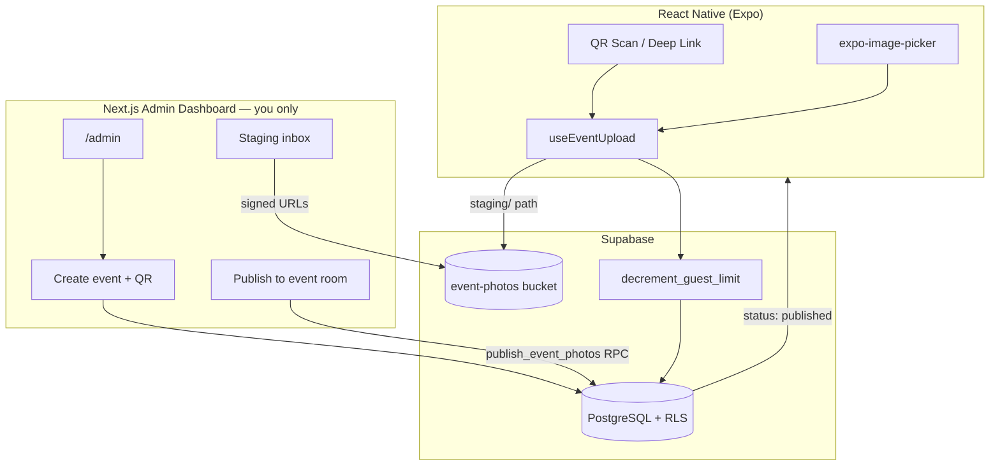

# Momentiim — Architecture

## System Overview

Momentiim is an event-scoped disposable camera. **You (admin)** create events from an internal dashboard. Guests scan a QR code, shoot a limited number of uncompressed photos, and uploads land in your **staging inbox** first. After processing (timing TBD — default placeholder is 24h after event), you **publish** photos to the guest-visible **event room**.

No Stripe or self-serve host billing — package tiers are admin-configured limits only.



## Photo lifecycle

| Stage | Who sees it | Storage path | DB status |
|-------|-------------|--------------|-----------|
| **Staging inbox** | Admin only | `staging/{event_id}/{guest_id}/{uuid}.ext` | `staging` |
| **Event room** | Guests in app | same path | `published` |

1. Guest uploads → file + DB row in **staging**
2. Admin opens event in dashboard → downloads/previews staging folder
3. Admin clicks **Publish to event room** (manual for now; auto at `reveal_scheduled_at` is TBD)
4. Guests see photos in mobile gallery (published only)

Default `reveal_scheduled_at` = event date + 24 hours (informational until auto-publish is built).

## Repository layout

```
momentiim/
├── docs/
│   ├── ARCHITECTURE.md
│   └── TESTING.md              # How to run on a physical phone
├── supabase/migrations/
├── packages/shared/types/
├── mobile/                     # Expo guest app
└── web/                        # Admin dashboard + API
    └── app/admin/
```

## Authentication

| Actor | Access |
|-------|--------|
| **Admin (you)** | `profiles.role = 'admin'` + optional `ADMIN_EMAILS` env allowlist |
| **Guest** | Supabase Auth (anonymous or email) on mobile |

### One-time admin setup

After creating your Supabase user:

```sql
UPDATE public.profiles SET role = 'admin' WHERE email = 'you@example.com';
```

Env (web `.env.local`):

```
NEXT_PUBLIC_SUPABASE_URL=
NEXT_PUBLIC_SUPABASE_ANON_KEY=
SUPABASE_SERVICE_ROLE_KEY=
ADMIN_EMAILS=you@example.com
NEXT_PUBLIC_APP_SCHEME=momentiim
```

## Admin dashboard routes

| Route | Purpose |
|-------|---------|
| `/admin/login` | Sign in |
| `/admin` | Event list |
| `/admin/events/new` | Create event + QR |
| `/admin/events/[id]` | Staging inbox, publish button, event room preview |

## API routes

| Route | Method | Purpose |
|-------|--------|---------|
| `/api/events/create` | POST | Admin: create event + QR |
| `/api/events/[id]/publish` | GET | Admin: list staging + published with signed URLs |
| `/api/events/[id]/publish` | POST | Admin: publish staging → event room |
| `/api/admin/tiers` | GET | Package tier dropdown |

## Package tiers (limits only)

| Tier | max_total_photos | per_guest_limit |
|------|------------------|-----------------|
| Starter | 500 | 10 |
| Standard | 2000 | 15 |
| Premium | 10000 | 25 |

## Deep link

```
momentiim://event/{eventId}
```

QR codes encode this URL for printed cards at events.

## Security

- Guests cannot read `staging` photos — RLS allows `published` only
- Admin has full read via `is_admin()` policies
- Limit enforcement stays in Postgres RPC (never trust client counters)
